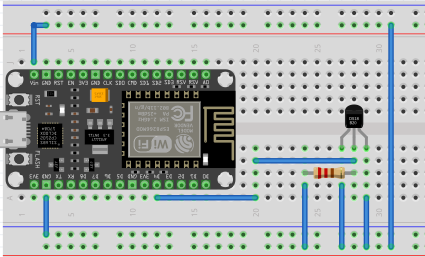

# DS18B20 Sensor Scanner

A simple ESP32-based program to scan and display the addresses of DS18B20 temperature sensors connected to a 1-Wire bus. This program helps identify all sensors on the bus, validate their addresses using CRC, and count the number of detected sensors.

## Features
- Scans the 1-Wire bus for connected devices.
- Displays the full 64-bit addresses of detected sensors in `0x[HEX]` format.
- Validates addresses using CRC.
- Counts the total number of detected sensors.
- Designed for ESP32, using GPIO 16 as the 1-Wire data pin.

## Requirements
- ESP32 (e.g., Lolin S2 Mini or similar board).
- DS18B20 temperature sensors.
- Pull-up resistor (4.7kΩ) connected between the data pin and VCC.
- Arduino IDE with the following libraries:
  - [OneWire](https://github.com/PaulStoffregen/OneWire)

## Pin Configuration

Connect the DS18B20 sensors as follows:
- **VCC**: 3.3V or 5V.
- **GND**: Ground.
- **Data**: GPIO 16 (pin can be changed in the code).
- Add a 4.7kΩ pull-up resistor between the data line and VCC.

## Installation
1. Clone this repository or download the ZIP file.
2. Open the:
- `src/DS18B20_Sensor_Scanner.ino` file in Arduino IDE,
- copy repository to vscode with Platformio plugin. 
4. Install the required libraries (see Requirements).
5. Upload the code to your ESP32 board.
6. Open the Serial Monitor and set the baud rate to `115200`.

## Usage
1. Connect one or more DS18B20 sensors to the configured pin (default: GPIO 16).
2. Upload the code to the ESP32 board.
3. Open the Serial Monitor to view the scanned sensor addresses and their count.

## License
This project is licensed under the [MIT License](LICENSE).
